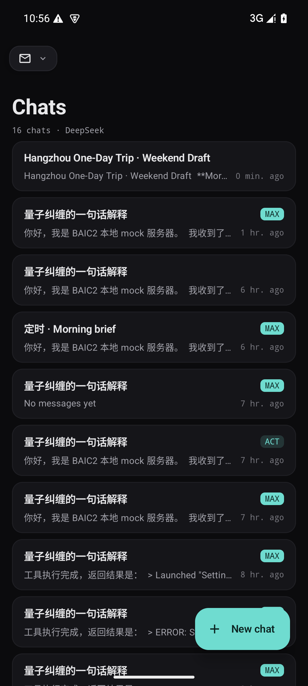
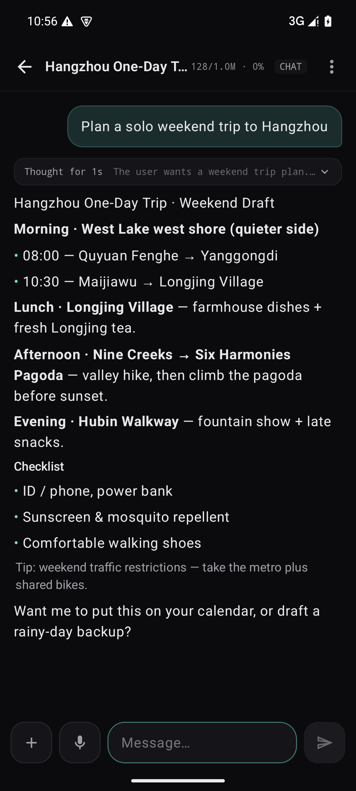
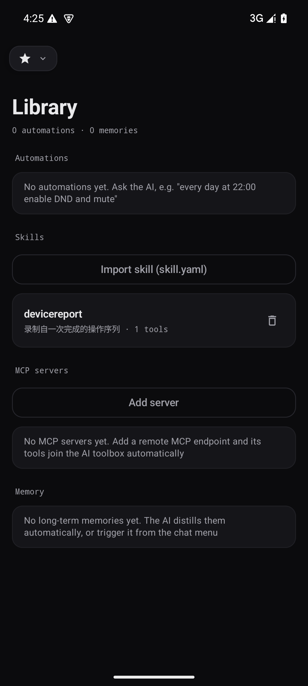
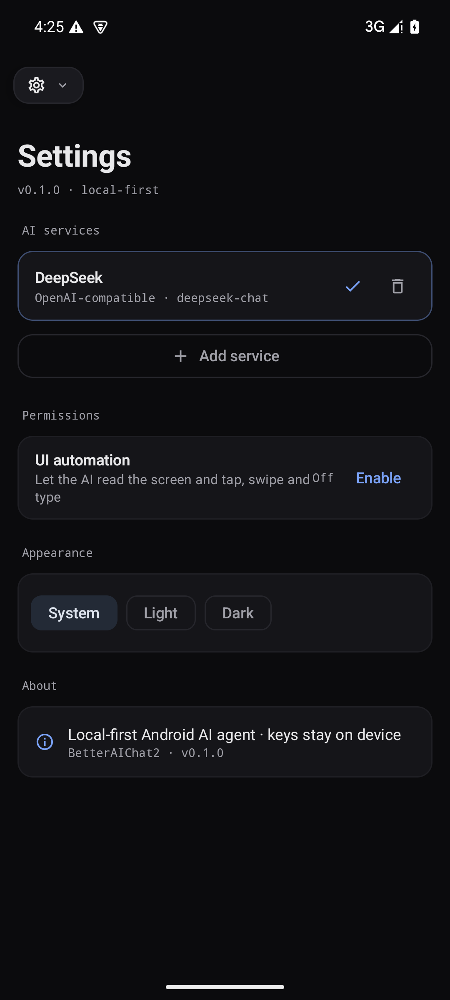

<p align="center">
  
</p>

<h1 align="center">BetterAIChat2</h1>

<p align="center">
  本地优先的 Android AI 智能体 · 让 AI 真正操作你的设备 · GPL-3.0-or-later
</p>

<p align="center">
  <a href="https://github.com/Verlintas/NovaBAIC/releases"></a>
  <a href="https://github.com/Verlintas/NovaBAIC/actions/workflows/build.yml"></a>
  <a href="LICENSE"></a>
</p>

## 简介

BetterAIChat2 是 [BetterAIChat](https://github.com/Verlintas/BetterAIChat) 的继任重制版（代号 Nova）：全新架构、全新 UI、面向设备操作的 Agent Runtime。它是**本地优先**的 AI 智能体 —— API Key 经 Android Keystore 加密留在设备上，没有云端、没有遥测、不需要账号；AI 通过**函数调用**真实操作你的手机：看屏、点击、输入、读写文件、设置提醒、跑自动化。

- 要求：Android 8.0（API 26）及以上
- 无 GMS 依赖；不包含统计 SDK；明文 HTTP 仅放行环回地址
- 支持任何 OpenAI 兼容端点（DeepSeek / Kimi / Qwen / GLM / Ollama / 网关…）以及 Claude、Gemini

## AI 编程提示

本项目由 AI 编程助手（opencode）参与开发：需求、审阅与发布由人类维护者完成，代码主要由 AI 编写。

- 使用、引用或二次开发前，请自行评估代码的正确性与安全性
- 如果你发现 AI 生成代码中的问题，欢迎提 [Issue](https://github.com/Verlintas/NovaBAIC/issues) 或 PR

## 截图

<p align="center">
  
  
  
  
</p>

## 下载与安装

- 下载：[GitHub Releases](https://github.com/Verlintas/NovaBAIC/releases/latest)
- 安装时系统会提示「未知来源」权限，属于侧载 APK 的正常流程
- 与旧版 BetterAIChat 分属不同应用（包名不同、数据不互通），可并存安装；新版使用新的签名密钥
- 后续版本共用同一密钥，可覆盖升级

## 功能

**聊天与模型**
- 流式回复、思考过程、Markdown（代码块 / 表格 / 列表 / 链接）、中止与重试
- OpenAI 兼容 / Anthropic Claude / Google Gemini 三家适配，统一重试与错误分类
- 附件：图片（视觉模型）、文本文件；语音输入与消息朗读
- 长期记忆（自动提炼 + 手动）、上下文压缩（>85% 自动）、AI 自动标题
- 对话搜索、收藏夹、Markdown 导出分享、消息复制 / 编辑重发 / 朗读 / 删除

**Agents 与模式**
- Agent = 服务商 + Key + 模型 + 温度 / 上限 / 深度思考 + 系统提示词；一键识别 Key 前缀、拉取模型列表
- `Chat`（纯对话）· `Chat+`（只读工具 + 计划）· `Act`（逐项确认）· `Max`（自主运行，预算约束）

**AI × 设备（48 个内置工具）**
- 看屏：`take_screenshot`、`screen_ocr`（ML Kit 中英，带坐标）
- 操作：`ui_control`（无障碍：按文字模糊查找并点击/长按、滚动查找、输入、按键、等待控件出现，一次调用完成定位→操作→校验）
- App 与系统：打开应用 / 设置页、音量 / 亮度 / 手电筒 / 铃声 / 勿扰、媒体控制、通知、剪贴板、分享、拨号
- 内容：文件读写与下载、文本文件、OCR 文件、二维码生成 / 识别、网页搜索与阅读、天气、RSS、汇率（内置计算）
- 个人：联系人、邮件、日历、提醒（单次 / 每日重复）、通知读取、位置、用量统计
- 进阶：Shizuku shell（规划中）、自动化引擎、Skills、子代理、MCP 远程工具

**自动化与技能**
- 自动化：定时（每日 / 按周）与电量触发，动作序列无人值守执行并回报通知
- Skills v2：YAML recipe 声明式技能，导入后按需加载为工具；也可以把一次完成的操作序列「保存为技能」
- 子代理：`spawn_agent` 独立上下文与预算（research 只读 / max 全量），可并行发起
- MCP：添加远程 Streamable HTTP 服务器，其工具自动并入工具箱

**任务与运行**
- Tasks 运行中心：运行记录（状态 / 模式 / 时长），点击直达会话
- 计划工件：`plan_update` + 聊天置顶计划卡，步骤状态实时更新
- 后台运行：前台服务保持长任务，通知栏可停止

## 权限

| 权限 | 用途 |
| --- | --- |
| 通知 | AI 通知、提醒与自动化结果 |
| 麦克风 | 语音输入 |
| 相机 | 手电筒、拍照相关工具 |
| 修改系统设置 | 亮度 / 屏幕超时（工具会引导授权） |
| 屏幕捕获 | 截屏、屏幕 OCR、分析屏幕（每次会话授权一次） |
| 无障碍 | UI 自动化（看屏、点击、输入）；按需开启 |
| 通知使用权 | 读取通知工具；按需开启 |
| 使用情况访问 | App 用量统计；按需开启 |
| 通讯录 / 位置 | 联系人、位置工具；按需开启 |
| Shizuku | 可选，root 级 shell 与 App 管理 |

所有权限均为按需授予；未授权时工具会返回明确的下一步指引，而不是静默失败。

## 技术栈与架构

Kotlin · Jetpack Compose (Material 3) · Hilt · Room · DataStore · OkHttp（自研 SSE 解析）· kotlinx.serialization · ML Kit 中文 OCR · ZXing · SnakeYAML

```
app                装配、导航、DI 入口
core:model         纯 Kotlin 领域模型          core:engine   AgentLoop / 确认队列 / 工具契约
core:data          Room + DataStore + 仓库 + Keystore 加密
core:network       OkHttp + SSE + 三家 Provider 适配
core:designsystem  设计系统 token 与组件
feature:*          chat / conversations / tasks / settings / agents / library
device:api|impl    截图 / OCR / 无障碍 / 语音 / 提醒 / 运行通知
tools              内置工具 + 自动化 + 技能 + 子代理
mcp                远程 MCP 客户端             eval          场景评测 harness
```

架构说明与决策记录见 [docs/ARCHITECTURE.md](docs/ARCHITECTURE.md) 与 [docs/adr/](docs/adr/)。

## 构建

```bash
# JDK 17 + Android SDK（platform 37, build-tools 37.0.0）
./gradlew :app:assembleDebug     # APK: app/build/outputs/apk/debug/app-debug.apk
./gradlew test                   # 单元测试
./gradlew lintDebug              # Android Lint
tools/check-license-headers.sh   # 许可头校验（CI 会跑）
```

本地联调不需要 API Key：`dev/` 下带两个 mock 服务器（OpenAI 兼容流式 + MCP），并且支持脚本化工具轮次（`tooltest:工具名`、`tooltest:auto`）。

## 参与贡献

- [CONTRIBUTING.md](CONTRIBUTING.md) · [CODE_OF_CONDUCT.md](CODE_OF_CONDUCT.md) · [SECURITY.md](SECURITY.md)
- [CHANGELOG.md](CHANGELOG.md)

## License

[GPL-3.0-or-later](LICENSE) © 2026 Verlintas. BetterAIChat2 is free software: you can redistribute it and/or modify it under the terms of the GNU General Public License.
